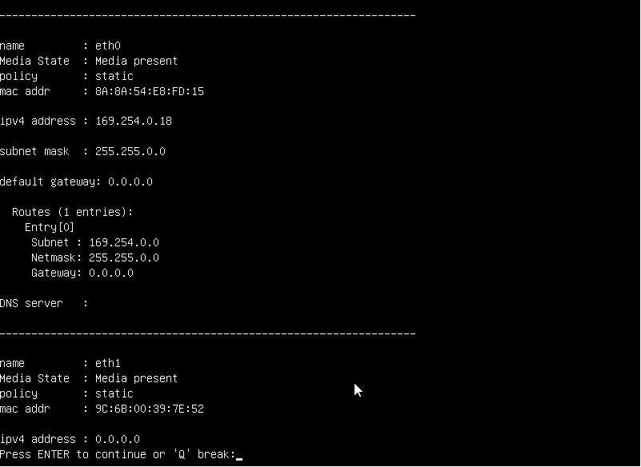
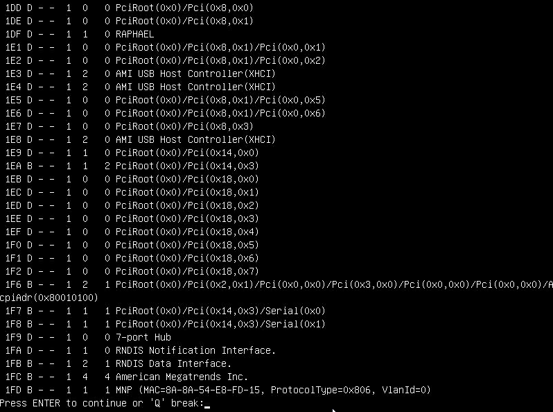
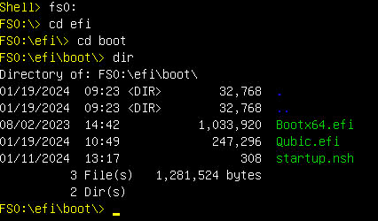

# Disconnect Not Needed Devices in EFI
The general process is:

1. Goto EFI Shell
2. Detect not needed devices
3. Disconnect them
4. Test

## Network Devices
To Start a Qubic Node we suggest to have only one active network connection or at least make sure the first available Adapter is the one which is connected.

On some Mainboards (e.g. asrock) you have a BMC/IPMI/DRAC Adapter which is also available in EFI. Because this mostly is the first adapter, we need to disconnect this to make Qubic able to start.

The following steps should help you to identify this not needed network adapter.

### Detect active network interface
First check your current network connection with `ifconfig -l -b`

You need now to find out which of those interfaces is your active one. If you use DHCP, you can do this by using the command `ifconfig -s eth1 dhcp`.

check again with `ifconfig -l -b` if the interface `eth1` now has an ip address it is the correct one.

Now note the last 4 letters of the MAC Adresses (e.g. `FD:15`) from the interfaces with lower number of your active one. For us this means we only need to know the MAC Address for interface `eth0`.

> Note the MAC Address `FD:15`

### Detect corresponding device
Now we need to find out the corresponding Hardware device which is responsible for the network interface we don't want to use.

Use the command `devices -b`. It lists all devices. With the option `-b` the list is paged. You can go to the next page with the `Enter` key.

Search the list for the identified MAC Address (`FD:15`).

You can see in the above screen shot the MAC Addrss we are looking for. From this entry we have to go up to the first "real" device. In our case it is the entry `1FC .... American Megatrends Inc.`.

> Note the Device ID: `1FC`

### Disconnect Device
Now remove the devices with: `disconnect <DEVICEID>`.

In our case this is: `disconnect 1FC`.

Check with `ifconfig -l -b` if the interface has disappeared. If yes, all good. If no, try better.

### Persist the change in startup.nsh
You can now add your findings to the startup.nsh file.

Change to your Qubic disk with e.g. `fs0:` and go to the `efi/boot` folder.

Edit the `startup.nsh` file with `edit startup.nsh`.

Add `disconnect <DEVICEID>` and adjust the `ifconfig` command to your needs.

you can close the editor with `CTRL+q`, choose `y` to save your changes.

### Test your changes
Reboot your Server and see if the connection now works.